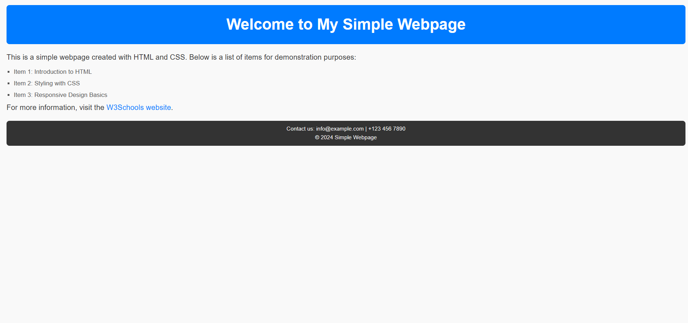

# Task 1: Create a Simple Web Page
### Objective: 
Practice the basic structure of an HTML5 document.

### Description: 
Students have to create a webpage with a header, paragraph, list, and a link. Include a footer with some contact information.

### Prompt:
please generate me a webpage with a header, paragraph, list, and a link. Include a footer with some contact information.  

### Result:

