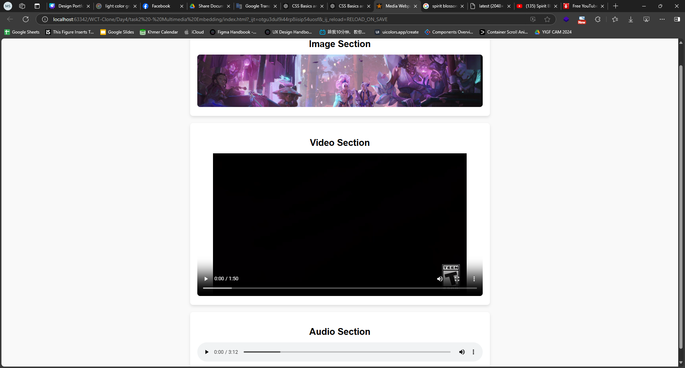

# Task 2: Multimedia Embedding
### Objective: 
Practice embedding multimedia elements using HTML5.

### Description: 
Students have to create a webpage that includes an image, a video, and audio.

### Prompt:
create a webpage that includes an image, a video, and audio. Each section should have a header and a wrapper around those. make sure those url are open so i can add them to it.
### Result:

