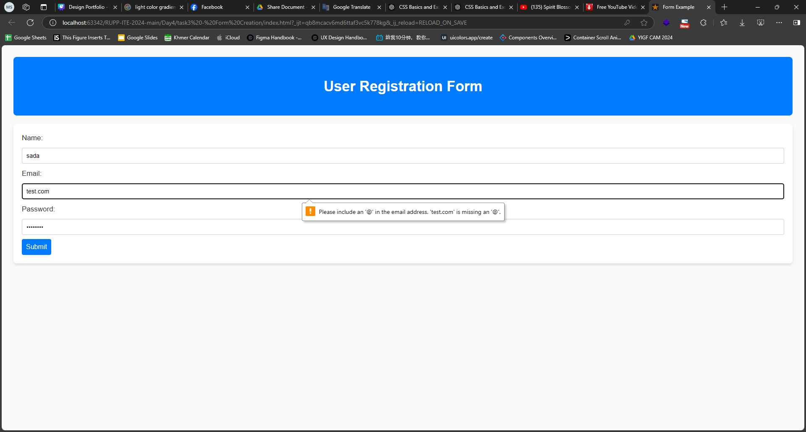

# Task 3: Form Creation

### Objective: 
Practice form elements using HTML5.

### Description: 
Students have to create a form with input fields such as text, email, password, and submit buttons. Include validation.

### Prompts:
Please create a form with input fields such as text, email, password, and submit buttons. Include validation for email. 

